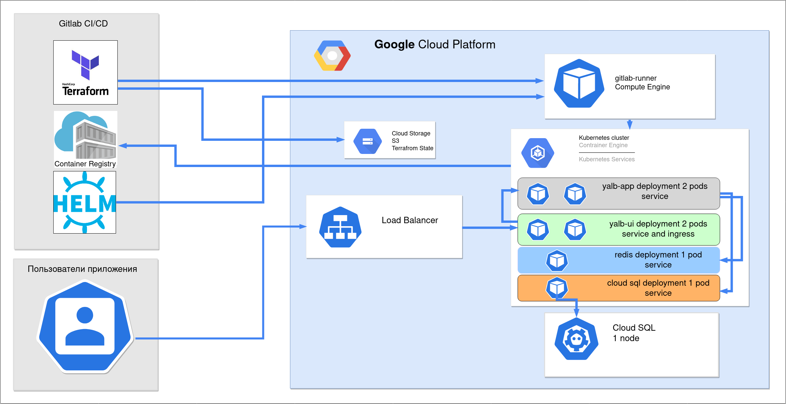
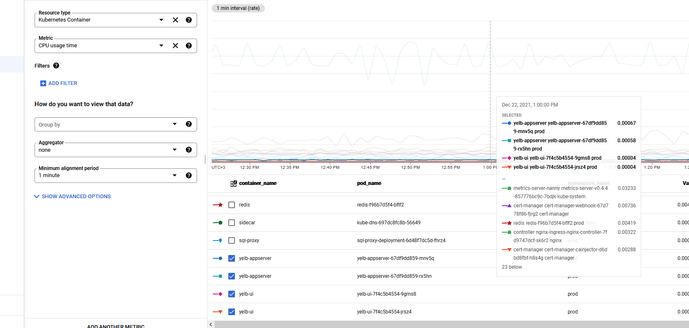
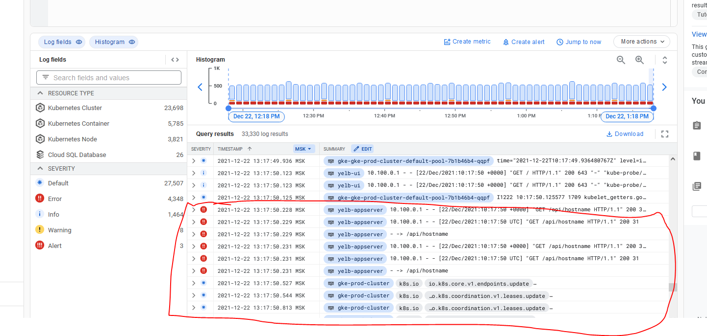

## Описание проекта

Проект состоит из двух репозиториев https://gitlab.com/perhamm/graduation_work и https://gitlab.com/perhamm/graduation_work_iac/

Само приложение запускается тут https://test3.club/

В первом репозитории располагается приложение и в нем содержаться следующие файлы и папки:

* Папки yelb-appserver, yelb-db и yelb-ui - папки с изначальным приложением, форкнутые из репо задания. В приложения внесены изменения. В бэкенд добавлены переменные для переопределения названий хостов баз данных. В приложении фронта внесены многочисленные правки, связанные с версиями node и библиотек, из-за сильно устаревших зависимостей (они буквально deprecated, например https://github.com/vmware-archive/clarity-seed обновлен последний раз 5 лет назад и помечен как архивный - как фронт вообще завелся, я, если честно, не очень понимаю)
* docker-compose.yml - создан для тестирования корректности запуска приложений после сборки
* Папка test - содержит тест для docker-compose.yml (просто дергает страничку приложения и читает код ответа)
* Папка deployments - не несет никакой роли, форкнута из изначального приложения
* .helm-minikube - позволяет запустить приложение в миникубе
* .helm_redis_and_cloudsql_ha - helm чарт для запуска HA редиса и HA cloudsql - попробовал что работает, но уходит слишком много денег (нужны дополнительные ресурсы для самого кубера - нод 3 штуки + в идеале 3 мастера + 2 ингресса, подов для редиса и sentinel - 3, подов под haproxy - 3, подов под прокси SQL - 3, дополнительная плата за HA Cloud SQL - это все поедает больше 10 долларов в час )))  )
* .helm - позволяет запустить приложение с 1 подом редиса с pvc, 1 cloud sql прокси и по паре бэкенд - фронтенд. При смерти редиса или sql прокси - они пересоздаются кубером автоматом, в течении 30 сек

Во втором репозитории располагается iac + всё описание проекта и в нем содержаться следующие файлы и папки:

* backend - модуль терраформа для настройки сети
* gke - модуль терраформа для настройки кластера 
* vds - модуль терраформа для настройки виртуальной машины под gitlab раннер
* cloudsql - модуль терраформа для настройки cloud sql

В gke - для оптимизации затрат используется только одна нода kubernetes (за каждую дополнительную ноды начисляется очень значительное количество денег в час + цена самой виртуалки под ноду) - но, если есть необходимость, можно просто увеличить количество нод<br/>
cloudsql - запускается без HA (за HA идет значительна доплата) - но, если есть необходимость, включить HA можно, если раскомментировать строчки про реплику<br/>
vds - просто виртуалка под раннер, раннер ставится и регистрируется автоматически через provision

Итого получается следующая схема работы приложения:




## Описание установки

### Создание проекта в GCP
Перед запуском нужно установить раннер в облаке, следовательно, первый запуск необходимо провести с локального компьютера.<br/>
Предполагается что gcloud, терраформ и kubectl установлен на локальном компьютере.<br/><br/>
~~Просто заметка для себя - удалить все старые auth для чистого использования консольной gcloud можно так:~~<br/>
~~```gcloud auth revoke --all```~~<br/><br/>
В консоли облака - создать новый проект - s015937 <br/>
У него будет уникальный id - например, s015937-335713<br/>
Зайти в iam-admin/serviceaccounts - сделать новый сервис аккаунт, назвать его terrafrom, дать роль owner и создать для него ключ JSON.<br/>
Этот ключ кинуть в корень скаченного репо graduation_work_iac под именем terraform.json<br/>
Далее включить нужные нам апи:<br/>
```
gcloud config set project s015937-335713
gcloud auth activate-service-account --key-file=terraform.json
gcloud services enable compute.googleapis.com  container.googleapis.com  sql-component.googleapis.com sqladmin.googleapis.com  servicenetworking.googleapis.com cloudresourcemanager.googleapis.com dns.googleapis.com
gcloud config set compute/zone europe-west3-a
gcloud config set compute/region europe-west3
```
Создать баскет в Cloud Storage с именем s015937-terraform-state<br/>
### Первое применение терраформа
Первое применение терраформа - с локального компа.<br/>
Взять токен из раздела настроек раннеров, отключить шаренные раннеры, придумать сложный пароль для постгреса.<br/>
```
terraform init
terraform plan -var="gitlab_runner_registration_token=token" -var="project_id=s015937-335713" -var="sql_pass=password"
terraform apply -var="gitlab_runner_registration_token=token" -var="project_id=s015937-335713" -var="sql_pass=password"
```
### Настройки CI обоих репозиториев
Для доступа по ssh к гитлаб-раннеру, если он нужен по каким-либо причинам, проще всего провалиться в него через <br/>
```gcloud compute ssh  gitlab-runner```<br/>
Вносим ```cat terraform.json  | base64 -w0``` в переменную **SERVICEACCOUNT** проекта graduation_work_iac в разделе CI/CD настроек. <br/>Туда же вносим **PROJECTID**, например, s015937-335713, **RUNNER_TOKEN** и пароль юзера postgres **SQL_PASS**. <br/>На этом этапе, если появился раннер в настройках - пайплайны должны заработать.<br/>
Включаем наш раннер в проекте graduation_work ( enable for this project)<br/>
Делаем экспорт kubectl config<br/>
```gcloud container clusters get-credentials gke-prod-cluster```<br/>
Узнаем точку входа<br/>
```kubectl cluster-info```<br/>
Добавляем её в **K8S_API_URL** в проекте graduation_work<br/>
### Настройки кластера для работы пайплайнов и приложения
Ставим в класетр ingress<br/>
```
helm repo add ingress-nginx https://kubernetes.github.io/ingress-nginx
helm repo update

kubectl create ns nginx
helm install nginx ingress-nginx/ingress-nginx --namespace nginx --set rbac.create=true --set controller.publishService.enabled=true

```
Ставим cert-manager<br/>
```
kubectl apply --validate=false -f https://raw.githubusercontent.com/jetstack/cert-manager/release-0.12/deploy/manifests/00-crds.yaml
kubectl create namespace cert-manager

helm repo add jetstack https://charts.jetstack.io
helm repo update

helm install cert-manager \
 --namespace cert-manager \
 --version v0.12.0 \
 --set ingressShim.defaultIssuerName=letsencrypt \
 --set ingressShim.defaultIssuerKind=ClusterIssuer \
 jetstack/cert-manager

```
После создания ингресс контроллера смотрим ip LoadBalancer - и заносим ip в А запись в днс своего домена.<br/>
```
kubectl get service -A
nginx          nginx-ingress-nginx-controller             LoadBalancer   10.103.250.72    34.159.44.133
```
Создаем аккаунт для входа<br/>
```
kubectl create namespace prod
kubectl create serviceaccount --namespace prod ci
cat << EOF | kubectl create --namespace prod -f -
        apiVersion: rbac.authorization.k8s.io/v1
        kind: ClusterRole
        metadata:
          name: prod-ci
        rules:
        - apiGroups: ["", "extensions", "apps", "batch", "events", "certmanager.k8s.io", "cert-manager.io", "monitoring.coreos.com", "networking.k8s.io"]
          resources: ["*"]
          verbs: ["*"]
EOF
kubectl create clusterrolebinding --namespace prod --serviceaccount prod:ci --clusterrole prod-ci prod-ci-binding
kubectl get secret --namespace prod $( kubectl get serviceaccount --namespace prod ci -o jsonpath='{.secrets[].name}' ) -o jsonpath='{.data.token}' | base64 -d
```
Добавляем токен в **K8S_CI_TOKEN** в проекте graduation_work<br/>
Проверить токен можно так<br/>
```
kubectl get clusterissuers --as=system:serviceaccount:prod:ci -n prod
```
Settings > Repository в репо приложения находим Deploy tokens и нажимаем Expand.<br/>
В поле Name вводим k8s-pull-token и ставим галочку рядом с read_registry.<br/>
Все остальные поля оставляем пустыми.<br/>
Нажимаем Create deploy token.<br/>
НЕ ЗАКРЫВАЕМ ОКНО БРАУЗЕРА!<br/>
Создаем image pull secret - для того, чтобы наш кластер Kubernetes мог получать образы из registry gitlab'а.<br/>
```
kubectl create secret docker-registry gitlab-registry --docker-server registry.gitlab.com --docker-email 'fyvaoldg@gmail.com' --docker-username '<первая строчка из окна создания токена в gitlab>' --docker-password '<вторая строчка из окна создания токена в gitlab>' --namespace prod
```
Создаем секрет для бд а также секрет с ключом от сервисного ака терраформа для sql proxy <br/>
```
kubectl create secret generic db \
  --from-literal=username=postgres \
  --from-literal=password=<YOUR-DATABASE-PASSWORD> \
  --from-literal=connectionname=<YOUR-INSTANCE_CONNECTION_NAME> \
  -n prod

#cd ../graduation_work_iac/

kubectl create secret generic cloudsql-instance-credentials \
--from-file=terraform.json=terraform.json \
-n prod

```
Также необходимо создать БД для приложения - например, с VM раннера, предварительно поставив psql <br/>
```
gcloud compute ssh  gitlab-runner
sudo -i
apt install postgresql-client-common postgresql-client -y

psql -v ON_ERROR_STOP=1 -h <HOST> --username postgres -W <<-EOSQL
    CREATE DATABASE yelbdatabase;
    \connect yelbdatabase;
	CREATE TABLE restaurants (
    	name        char(30),
    	count       integer,
    	PRIMARY KEY (name)
	);
	INSERT INTO restaurants (name, count) VALUES ('outback', 0);
	INSERT INTO restaurants (name, count) VALUES ('bucadibeppo', 0);
	INSERT INTO restaurants (name, count) VALUES ('chipotle', 0);
	INSERT INTO restaurants (name, count) VALUES ('ihop', 0);
EOSQL
```
### Проверка переменных и пробный запуск
Итого, должны быть следующие переменные:

**graduation_work**: K8S_API_URL K8S_CI_TOKEN

**graduation_work_iac**: PROJECTID RUNNER_TOKEN SERVICEACCOUNT SQL_PASS

Проверяем, сделав пробный запуск (ну или можно сразу запустить пайплайн проекта с приложением)<br/>

```
helm upgrade --install graduationapp .helm -f .helm/values.yaml --namespace prod

```
Если нужна диагностика - можно запустить под внутри кластера<br/>
```
kubectl run -t -i --rm --image centosadmin/utils test bash -n prod
apk --update add redis
apk --update add postgresql-client
psql -h yelb-db --username postgres -W

```
### Удаление или частичное отключение
Все удалить - terraform destroy и удалить раннер из списка раннеров. Иногда залипает удаление SQL на каком-то модуле - удаляем из консоли, например, вот так<br/>
```
terraform state list
terraform state rm module.cloudsql.google_sql_user.user
terraform destroy
```
 Чтобы совсем окончательно все удалить - удалить баскет, и затем - отключить проект.<br/>

## Мониторинг и логи

Для мониторинга очень удобно использовать встроенные средства GCP<br/>
Пара скриншотов с логами и метриками <br/><br/>
Вот тут метрики подов - видны CPU Usage<br/><br/>
<br/><br/><br/>
А тут очень удобно смотреть логи контейнеров<br/><br/>

